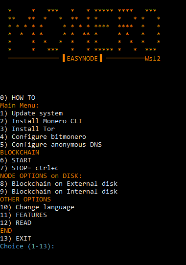
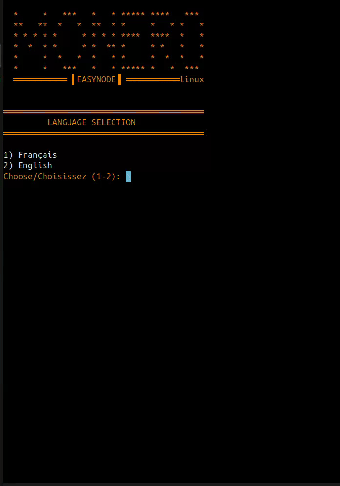
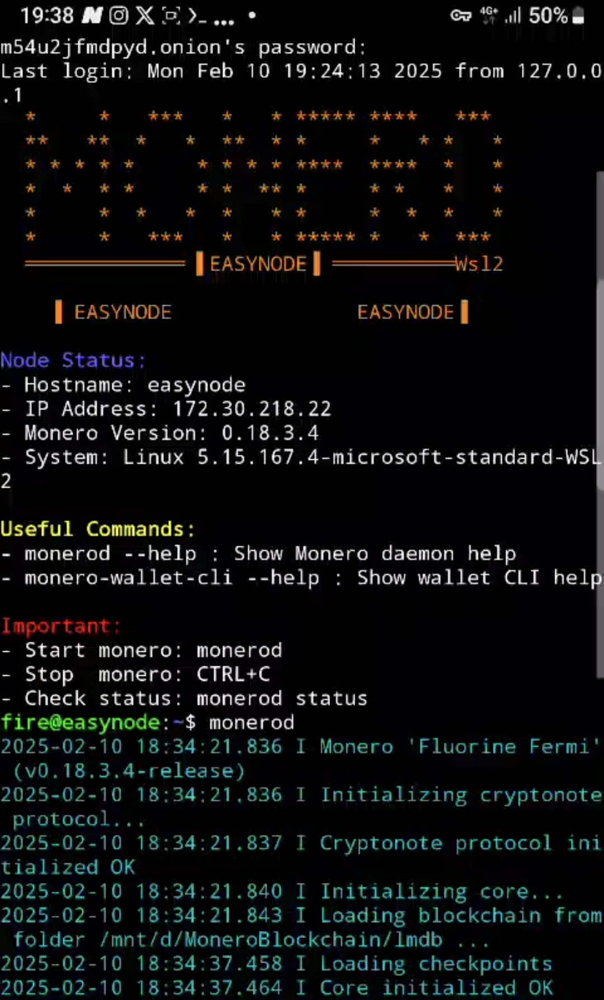
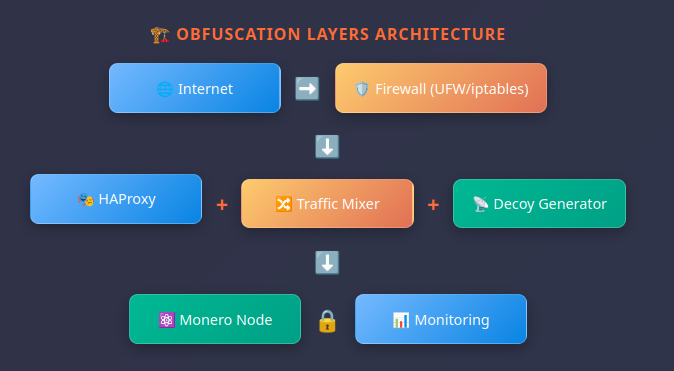
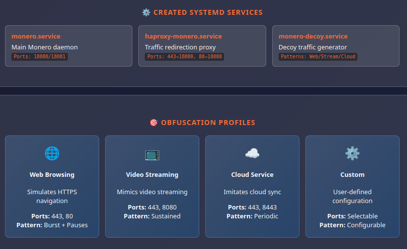

[](mailto:easynode@kerlann.org)
[](https://easynode.kerlann.org/fr.html)
[](https://easynode.kerlann.org/ecosystem.html)
[](https://bank-exit.org/tutoriels/monero-node-easymonerod)


<div align="center"></div>

<div align="center">

## Make easy a MONERO Node 


<br>
<br>

[▶️ Demo video](https://mega.nz/file/ouMG0SDJ#igwGyqrULhiLhLP7O1jYGg6SnllphMvWJ6-gCLxJZTM) *("Open in new tab")*

</div>

<hr style="border-top: 3px solid orange;">
<div align="center">

## Easynode with TRAFFIC OBFUSCATION

</div>

**EasyNode TRAFFIC OBFUSCATION** simplifies the installation of a **'MONERO node'** with advanced **traffic obfuscation** capabilities, allowing you to configure your blockchain in just a few clicks. 

**-Inclued 0.18.4.6 Monero CLI and officiel Hash verification** (2026-03-12)

 A complete setup in less than 10 minutes!

🆕 **NEW**: TCP traffic modification to enhance network privacy and make your Monero node traffic less detectable.

Then download its blockchain ⬇️ ...

Finally, start your adventure, you are sovereign...

You can use it in 🐧Linux versions. 

Compatible with the entire Ubuntu/Debian ecosystem. 

No knowledge required. Select step 1➡️2➡️3➡️4➡️5 and you're done. 

After,  Boot to your internal drive, 6️⃣, or move the blockchain to your external disk, 8️⃣.

The node is protected by Tor and an onion address allows you to connect to a mobile wallet.

An SSH onion address is available to access the node remotely.

Added the 'MRL' IP ban list of 'boog900'.

🆕 **Traffic Obfuscation Mode**: Automatically modifies outbound TCP traffic to make your Monero node less detectable by network analysis.

Enjoy.

### ❕ DISCLAIMER ❕

This script is designed **for dedicated Monero node PCs** with Monero_Gui and could makes system modifications.

- Don't use on primary computers first.

## <div align="center">🖥️ Interface:</div>
<div align="center">
<!---->



  <b> SSH REMOTE:</b>
<br>




<br>
<br>

[](https://mega.nz/file/ouMG0SDJ#igwGyqrULhiLhLP7O1jYGg6SnllphMvWJ6-gCLxJZTM) 

<a>right click + "Open in new tab"</a>

 <br>

</div>

## <div align="center">📝 HOW TO</div>

### Internal disk :
- Follow the step 1➡️2➡️3➡️4➡️5
- Then do : Step 6️⃣

### External Disk :
- Follow the step 1➡️2➡️3➡️4➡️5
- Then do : Step 8️⃣ and 6️⃣

### 🆕 Traffic Obfuscation Mode :
- Complete basic setup first (steps 1-5)
- At step 6️⃣: Choose "Yes" for automatic traffic obfuscation
- Or configure manually via option 1️⃣0️⃣ - 1️⃣

```
1️⃣ Option 1: System update
2️⃣ Option 2: Install Monero
3️⃣ Option 3: Install Tor
4️⃣ Option 4: Configure bitmonero
   ├── Choice: With password (secure)
   │   └── Instructions: Remote → Local after sync
   └── Choice: Without password (direct)
       └── Instructions: Local directly
5️⃣ Option 5: Privacy-friendly DNS
6️⃣ Option 6: Start blockchain (with obfuscation option)
8️⃣ Option 8: External disk (PRESERVES option 4 choice)
9️⃣ Option 9: Return to internal disk (PRESERVES option 4 choice)
🆕 Option 1️⃣0️⃣ : Traffic obfuscation configuration
```

## <div align="center">📥 Download:</div>
<div align="center">
  
⇨ 📂 Into path: `/home/$user`
</div>

<div align="center">

| Version | Links |
|---------|------|
| 🐧 Linux | [](https://github.com/kerlannXmr/Easynode_traffic_obfuscation/releases/download/v6/easynode_traffic_obfuscation.sh) |


</div>

## <div align="center">🚀 Installation</div>

### 🔒 IP ban_list: (spy, malicious)

◇  Automatic updated 'IP ban-list' in this folder :
-  `/home/$user/.bitmonero`

( Updated: github.com/Boog900/monero-ban-list/blob/main/ban_list.txt )

## 🐧 Linux : Debian, Ubuntu derivatives, Others...

### ↪️ Download & Install & run script:

- ⚡Beginner users: copy&paste in new terminal

```bash
wget https://github.com/kerlannXmr/Easynode_traffic_obfuscation/releases/download/v5/easynode_traffic_obfuscation.sh -O easynode_traffic_obfuscation.sh && chmod +x easynode_traffic_obfuscation.sh && sudo ./easynode_traffic_obfuscation.sh
```

- Normal users: copy&paste in new terminal

```bash
sudo wget -P ~ https://github.com/kerlannXmr/Easynode_traffic_obfuscation/releases/download/v5/easynode_traffic_obfuscation.sh
```
(script goes in folder) " /home/$user "

### ➡️Make it executable

```bash
sudo chmod +x easynode_traffic_obfuscation.sh
sudo ./easynode_traffic_obfuscation.sh
```

## <div align="center"> ❔ How it Works ❔

## 🏗️ Multi-Layer Architecture

```
┌─────────────────────────────────────────────────────────────┐
│                     🌐 INTERNET                             │
└─────────────────────┬───────────────────────────────────────┘
                      │
┌─────────────────────▼───────────────────────────────────────┐
│              🛡️ FIREWALL LAYER                              │
│           • UFW/iptables configuration                      │
│           • Allowed ports: 22,80,443,18080,18081            │
└─────────────────────┬───────────────────────────────────────┘
                      │
┌─────────────────────▼───────────────────────────────────────┐
│              🎭 OBFUSCATION LAYER                           │
│  ┌─────────────┐  ┌─────────────┐  ┌─────────────────────┐  │
│  │   HAProxy   │  │Traffic Mixer│  │  Decoy Generator    │  │
│  │ 443→18080   │  │ iptables    │  │ Fake patterns       │  │
│  │ 80→18080    │  │ TTL/TOS/MSS │  │ Web/Stream/Cloud    │  │
│  └─────────────┘  └─────────────┘  └─────────────────────┘  │
└─────────────────────┬───────────────────────────────────────┘
                      │
┌─────────────────────▼───────────────────────────────────────┐
│               🧅 TOR LAYER                                  │
│           • Hidden .onion services                          │
│           • RPC anonymization                               │
│           • SSH remote access                               │
└─────────────────────┬───────────────────────────────────────┘
                      │
┌─────────────────────▼───────────────────────────────────────┐
│               ⚛️ MONERO LAYER                               │
│           • Monero Node (Port 18080/18081)                  │
│           • Blockchain synchronization                      │
│           • Secure RPC (optional)                           │
└─────────────────────────────────────────────────────────────┘
```
## 📊 Effectiveness Comparison

| Aspect | Monero + Tor Only | Monero + Obfuscation + Tor |
|--------|-------------------|----------------------------|
| **Visible port** | ❌ 18080 (Monero signature) | ✅ 443/80 (web standard) |
| **DPI detection** | ❌ Identifiable protocol | ✅ HTTPS/HTTP traffic |
| **Traffic analysis** | ❌ Recognizable patterns | ✅ Mixed with decoys |
| **Network headers** | ❌ Standard TCP headers | ✅ Randomized TTL/TOS/MSS |
| **ISP surveillance** | ❌ Node easily spotted | ✅ Completely invisible |
| **Network censorship** | ❌ Port 18080 blockable | ✅ Bypass via web ports |
| **P2P protection** | ❌ Direct Monero protocol | ✅ Masked as web traffic |
| **RPC protection** | ✅ Tor .onion anonymity | ✅ Tor + traffic camouflage |
| **Node fingerprinting** | ❌ Detectable as Monero | ✅ Appears as web server |
| **Deep packet inspection** | ❌ Protocol signatures visible | ✅ Completely obfuscated |
| **Traffic correlation** | ⚠️ Timing analysis possible | ✅ Decoy traffic prevents correlation |
| **Overall stealth** | ⚠️ Partial protection | ✅ Maximum invisibility |



## <div align="center">⚡ Features</div>

## 📋 Essential Features / Fonctionnalités Essentielles

| **Feature / Fonctionnalité** | **Do** | **Details / Détails** |
|-------------------------------|------------------|------------------------|
| **🎯 One-Click Installation** | Complete automated setup | 13-step guided menu |
| **🛡️ IP Ban Protection** | Auto-blocks malicious nodes | 3-month bans from github ban-list |
| **🔒 Enhanced Security** | Tor + SSH + IP banning | `.onion` addresses generated |
| **💾 Flexible Storage** | Internal/External disk support | Automatic mounting & UUID config |
| **📊 Real-time Monitoring** | Live peer connections display | IN/OUT peers with colors |
| **🛡️ Automatic Firewall** | Pre-configured ports & UFW | All Monero ports opened |
| **🔧 Zero Configuration** | No Linux expertise needed | Beginner-friendly interface |
| **🛑 Safe Shutdown Control** | CTRL+C clean blockchain stop | Prevents corruption & returns to menu |
| **⚖️ Blockchain Size Options** | Choose Full (220GB) or Pruned (90GB) | Flexible storage requirements |
| **🌐 Anonymous DNS Setup** | Secure DNS auto-configuration | Privacy-focused DNS servers |

- ✅ Automated installation
- ✅ Disk management (internal/external)
- ✅ Built-in Tor (Tor/SSH onion address)  
- 🔒 Block IP 'ban listed' (MRL) [👉Issue](https://github.com/kerlannXmr/EasyMonerod/issues/3#issue-2871012436)*(right click + "Open in new tab")*          
- 🔒 TOR SSH remote access :  [👉Issue](https://github.com/kerlannXmr/EasyMonerod/issues/2#issue-2870954425)*(right click + "Open in new tab")*                              
- ✅ Intuitive user interface
- ✅ no knowledge required

## <div align="center">⚠️ Important</div>

-➡🟧 REDIRECT port 22 and 18080 from your internet router to your ' local ip ' of your PC.

-18080 allows other Monero nodes to connect to your node, increasing the decentralization and resilience of the network. [👉Issue](https://github.com/kerlannXmr/EasyMonerod/issues/10)

-➡🟧 The external hard drive must be formatted in NTFS (classic) or exFat or ext4.

Because FAT doesn't handle files larger than 4 GB!  [👉Issue](https://github.com/kerlannXmr/EasyMonerod/issues/9)    

-➡📗  Remote access wallet:
  
  Take 'cake wallet', settings, connect and sync, manage nodes, add +, node address= onion Tor, node port= 18081, save. Close and open. Wait the sync.

  or

  Take "Monero Gui", choose "Distant Mode" then " + add new node " and write 'IP local' or 'IP WEB' and port " 18081 "
  
-➡📗  Remote access ssh, port 22:
   
  Open terminal pc or take 'Termux' on android: ' ssh username@local_ip_pc ' . Or ' ssh username@onion_ssh_address '.[👉Issue](https://github.com/kerlannXmr/EasyMonerod/issues11) 
    
-➡🟧 Stop the Blockchain : CTRL+C 

## <div align="center">🔄 Compatibility</div>

<div align="center">
<br>
  
| Distribution | Compatibilité | Notes |
|--------------|---------------|-------|
|      ✅      |       ✅      |     ✅ |

</div>

 **Shell scripts ' EasyNode 'use standard commands that are more portable across different Linux distributions.**
<br>
-➡📗[👉View Issue Distribution compatibility](https://github.com/kerlannXmr/EasyMonerod/issues/8)*(right click + "Open in new tab")*  
<br>
<br>

## <div align="center">🔰 Packages installed by EASYNODE</div>

<br>

- 📝   See the list of packages at this issue [👉PACKAGES list pre-installed ](https://github.com/kerlannXmr/EasyMonerod/issues/6)*(right click + "Open in new tab")*

<br>

## <div align="center">☣️ EasyNode Scripts TEST report</div>

<div align="center">

### Security Scan Results
  
 <b>Right click + "Open in new tab" to view scann results </b>

| Script | Jotti.org | MetaDefender | virscan |
|--------|------------|--------------|--------------|
| EasyNode_obfuscation | [](https://virusscan.jotti.org/en-US/filescanjob/6q4nz99gpv) | [](https://metadefender.com/results/url/aHR0cHM6Ly9naXRodWIuY29tL2tlcmxhbm5YbXIvRWFzeW5vZGVfdHJhZmZpY19vYmZ1c2NhdGlvbi9yZWxlYXNlcy9kb3dubG9hZC92NC9lYXN5bm9kZV90cmFmZmljX29iZnVzY2F0aW9uLnNo) | [](https://www.virscan.org/report/4e6f32edbcac140b4dee114b288c39e6607a6ad173333c6645bbe87569ad5bdf)


</div>

<br>

---


### ⚠️ Security disclamer

| 💚  **DESIGNED FOR** | 🖥️ **Dedicated PC for Monero Node Only with Monero_Gui** |
|:---:|:---|
| ⚠️ **WARNING** | 🚫 **Don't use on primary computers first** |


---

## 💬  Contact

[](mailto:0595c16adb0e1f467740b5bb4d7e51c8b25042695bc4bd9ebd2e66902720dcbb02)
[](https://matrix.to/#/!diwbZJBzNngFIyfVVh:matrix.org?via=matrix.org)
[](https://simplex.chat/contact#/?v=2-7&smp=smp%3A%2F%2F0YuTwO05YJWS8rkjn9eLJDjQhFKvIYd8d4xG8X1blIU%3D%40smp8.simplex.im%2FhVfnrjb6LGrdWF8dcfEO_3funYfYrCsm%23%2F%3Fv%3D1-3%26dh%3DMCowBQYDK2VuAyEA6eMOBbH4MauXsCWIaZO8r1P7QPCorbwiOSHz0rofgUI%253D%26srv%3Dbeccx4yfxxbvyhqypaavemqurytl6hozr47wfc7uuecacjqdvwpw2xid.onion&data=%7B%22type%22%3A%22group%22%2C%22groupLinkId%22%3A%22IB1UQAdA78A2sbjixkya_g%3D%3D%22%7D)
[](mailto:easynode@kerlann.org)

## ♠️ Support

- 📝 Consult F.A.Q. [👉Questions](https://github.com/kerlannXmr/EasyMonerod/issues/5)*(right click + "Open in new tab")*
- 📝 Consult the [👉Documentation](https://tinyurl.com/kerlann)*(right click + "Open in new tab")*

## 🫶 Thankful

- 🇫🇷 Thanks [👉unbanked0](https://github.com/Unbanked0)*(right click + "Open in new tab")*


<div align="center">

---
### Support Development

**If ' EasyNode ' helped you achieve privacy, consider supporting development:**

###  <b>Make donnation with 'cake wallet' to : ' kerlann.xmr '</b>
<div align="center"></div>
or fundraiser

[](https://xmrchat.com/easymonerod)
[](https://kuno.anne.media/fundraiser/dkbu)

---

**🔒 PRIVACY MATTERS 🔒**

*Made with ❤️ for the Monero community*

[⭐ Star this repo](https://github.com/[username]/EasyNode-Tunnels) | [🍴 Fork it](https://github.com/[username]/EasyNode-Tunnels/fork) | [📢 Share it](https://twitter.com/intent/tweet?text=Check%20out%20EasyNode-Tunnels%20-%20Privacy-focused%20Monero%20node%20installer%20with%20Tor%20and%20VPN%20support!&url=https://github.com/[username]/EasyNode-Tunnels)

</div>
<div align="center"></div>

